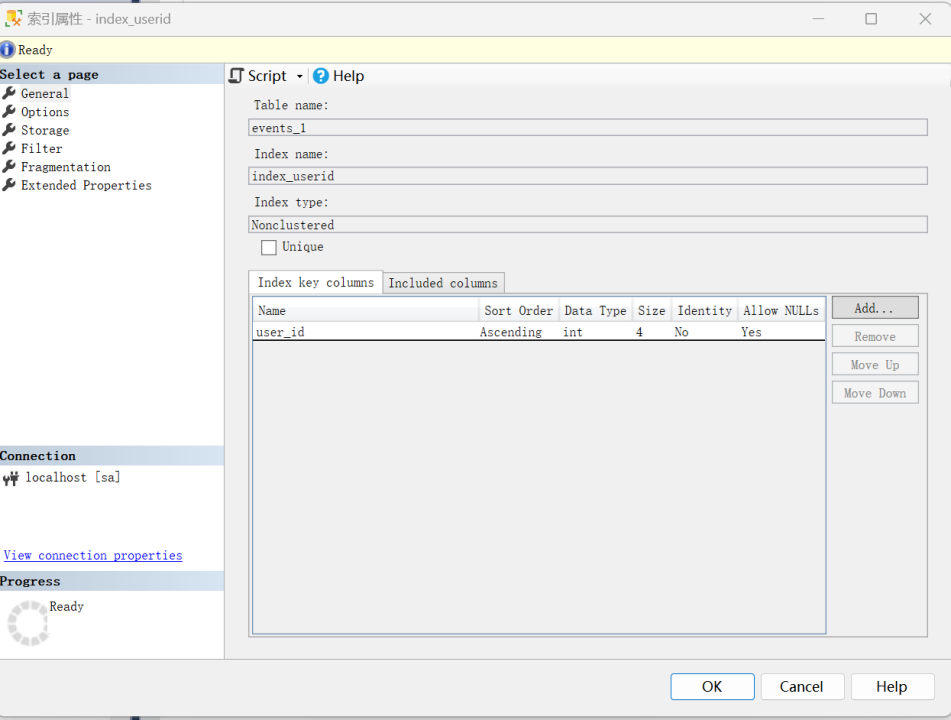
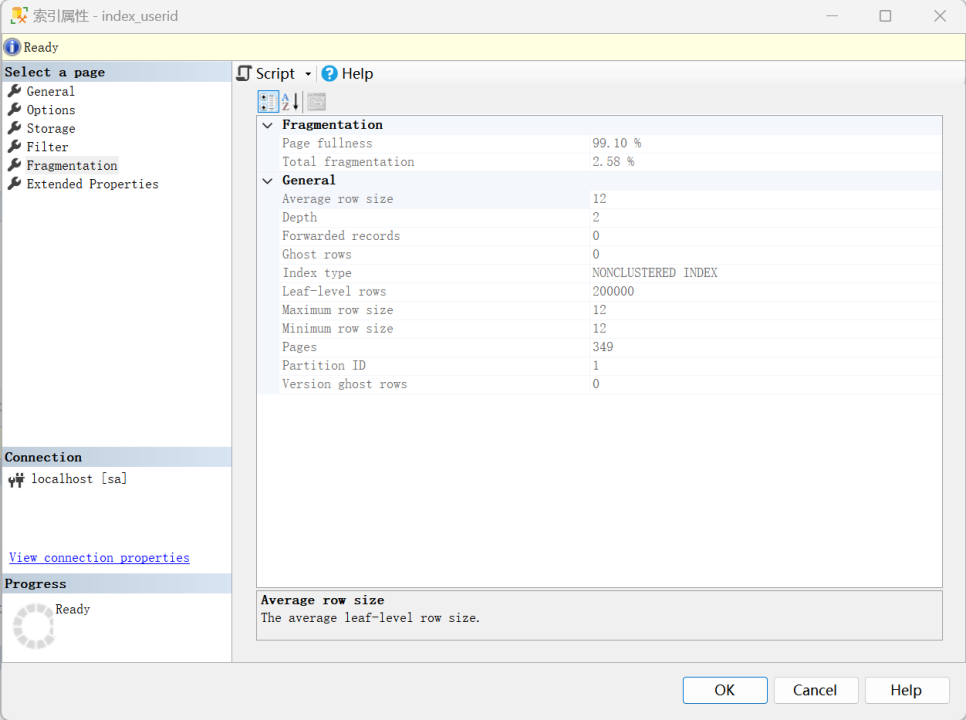
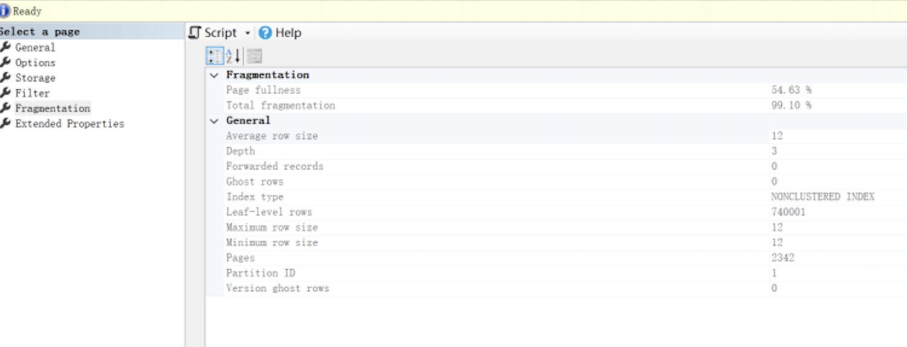
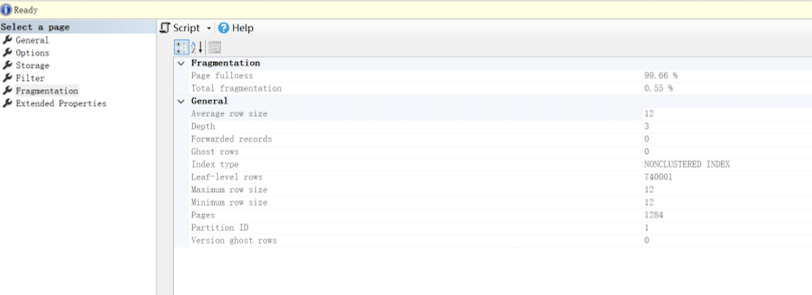

## Solution
### Step 1: Initial state of the index fragment
This is a non-cluster index 

This is the initial state of the index fragment

### Step 2: Upload Data and Do index maintenance
Now we upload data, and we generate index fragmentation
Index maintenance REORGANIZE 15-30% of fragmentation
**REBUILD** more than 30%
In this example **REBUILD** index

**Check index fragmentation again.**

The rebuild operation reduced the index fragmentation from 99.10% to 0.55%, indicating a successful optimization of the index's structure and an enhancement of database performance.
## Conclusion

- **Maintenance Necessity**: The initial fragmentation metrics highlighted the necessity for index maintenance to prevent performance degradation.
- **Performance Improvement**: Lower fragmentation typically correlates with improved performance, especially in read-intensive operations. The optimized table is likely to exhibit better efficiency in data retrieval.
- **Maintenance Effectiveness**: The maintenance procedure, which in this case was a rebuild, effectively minimized fragmentation and optimized the index structure.
- **Ongoing Maintenance Plan**: It is advised to implement a routine maintenance plan that includes regular fragmentation checks to proactively manage index health.
- **Strategic Maintenance Approach**: A tailored maintenance strategy should be developed, taking into account the specific patterns of database usage and performance metrics, to maintain the integrity and efficiency of the index over time.

